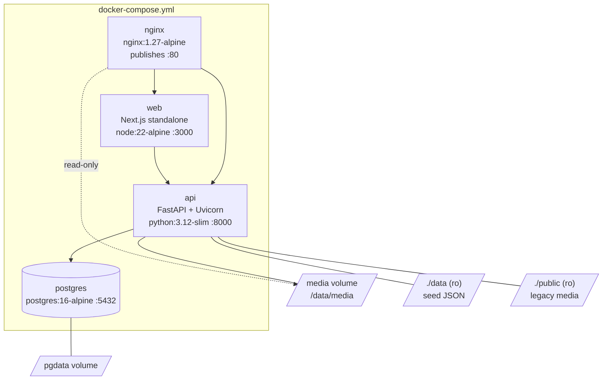
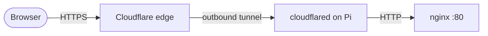
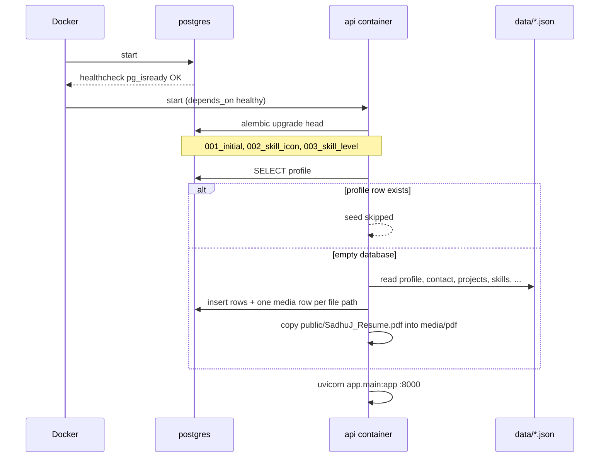
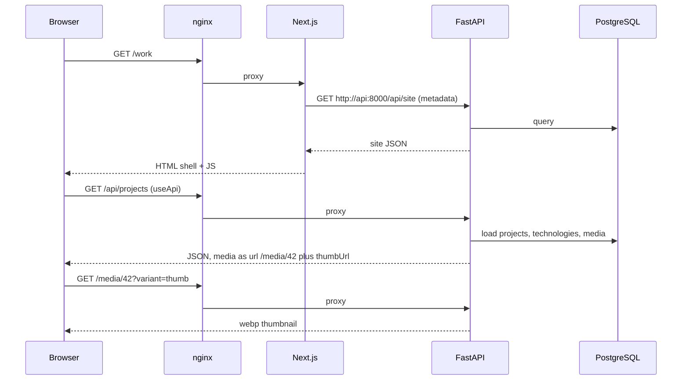
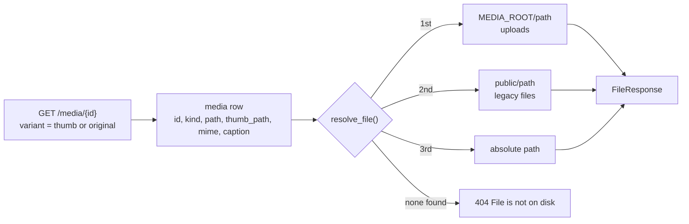
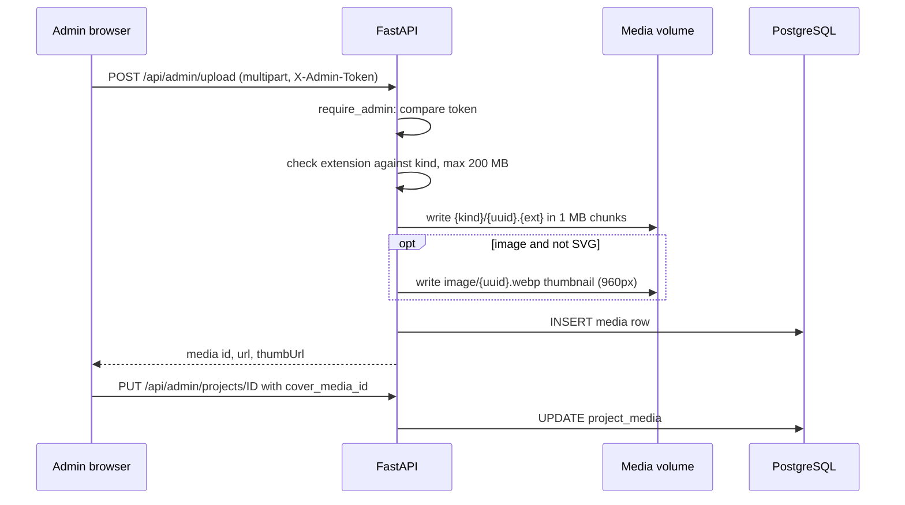
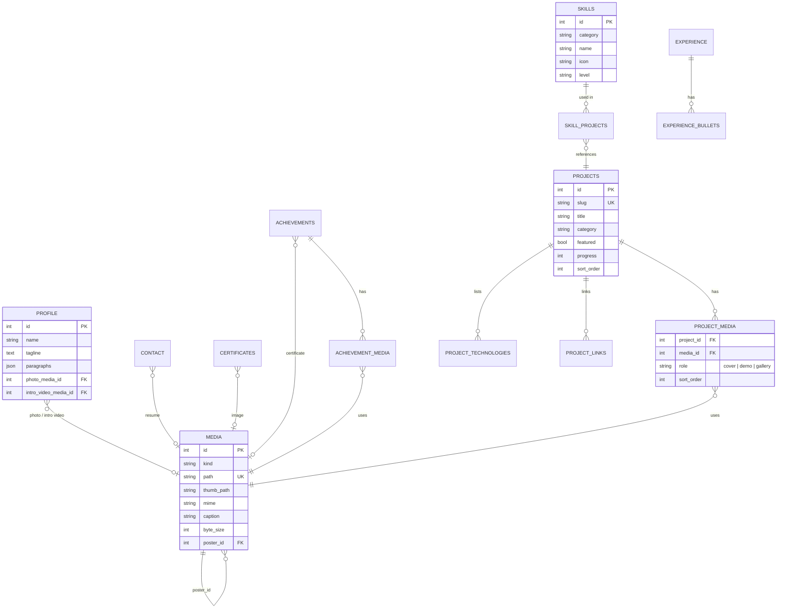

# Architecture

This document describes how Signal Desk is put together: the containers, how a request moves through them, how media is stored, and what the database looks like.

- [Containers](#containers)
- [Routing](#routing)
- [Startup and seeding](#startup-and-seeding)
- [Page load flow](#page-load-flow)
- [Media flow](#media-flow)
- [Admin upload flow](#admin-upload-flow)
- [Data model](#data-model)
- [Security boundaries](#security-boundaries)
- [Backups](#backups)

---

## Containers



| Service | Image | Port | Depends on | Volumes |
|---------|-------|------|------------|---------|
| `postgres` | `postgres:16-alpine` | 5432 (internal) | none | `pgdata` |
| `api` | built from `backend/Dockerfile` | 8000 (internal) | `postgres` healthy | `media`, `./data:ro`, `./public:ro` |
| `web` | built from `Dockerfile` | 3000 (internal) | `api` | none |
| `nginx` | `nginx:1.27-alpine` | **80 (published)** | `web`, `api` | `media:ro`, `deploy/nginx.conf` |

`docker-compose.dev.yml` runs only `postgres` and `api`, and publishes 5432 and 8000 so `npm run dev` on the host can reach them.

---

## Routing

nginx (`deploy/nginx.conf`) is the only entry point.

| Path | Goes to | Notes |
|------|---------|-------|
| `/api/*` | `api:8000` | Public JSON and `/api/admin/*` |
| `/media/{id}` | `api:8000` | Streams a media row by numeric id |
| `/media/<kind>/<file>` | media volume | Served directly by nginx (`alias /data/media/`) |
| `/*` | `web:3000` | Next.js pages and static assets |

`client_max_body_size` is 220 MB so 200 MB uploads fit.

In local development there is no nginx. `next.config.ts` rewrites `/api/*` and `/media/*` to `API_URL` instead, so the browser code is identical in both setups.

With Cloudflare Tunnel, `cloudflared` forwards the public hostname to `http://nginx:80`, and nothing else changes:



The tunnel is an outbound connection from the Pi, so no router port forwarding is needed. Cloudflare's free plan limits request bodies to 100 MB, so larger uploads should be done on the LAN.

---

## Startup and seeding



Because the seed skips once a profile exists, restarting or rebuilding never overwrites content edited in `/admin`. To re-seed from the JSON files you need an empty database (`docker compose down -v` wipes both the database and uploaded media).

Until the seed has run, public endpoints return `503 Portfolio is not seeded`.

---

## Page load flow

Each route in `app/` exports `generateMetadata()` (server-side, fetches `/api/site` for the title) and renders a client view from `components/views/`.



`lib/api.ts` decides the base URL:

- On the server, it uses `API_URL` (`http://api:8000` inside Docker).
- In the browser, it uses `NEXT_PUBLIC_API_URL`, which is empty in Docker, so requests go to the same origin and nginx routes them.

---

## Media flow

A media file has two parts: the bytes on disk and a row in the `media` table. Content tables reference the row by id.



When the API serializes content, each media reference becomes:

```json
{ "id": 42, "kind": "image", "url": "/media/42", "thumbUrl": "/media/42?variant=thumb",
  "caption": "...", "missing": false, "filename": "cr35.jpg" }
```

`missing` is checked on every request, so dropping a file into `public/` at the path the seed registered makes a placeholder disappear on the next refresh. `MediaFrame` renders `<Image>`, `<video>` or `<audio>` by `kind`, and shows a "not on disk yet" placeholder when `missing` is true.

Where media is attached:

| Owner | Column or table |
|-------|-----------------|
| Profile photo, intro video | `profile.photo_media_id`, `profile.intro_video_media_id` |
| Resume | `contact.resume_media_id` |
| Project cover, demo, gallery | `project_media(media_id, role, sort_order)` |
| Achievement certificate and gallery | `achievements.certificate_media_id`, `achievement_media` |
| Certificate image | `certificates.media_id` |
| Video poster | `media.poster_id` |

---

## Admin upload flow



Accepted types:

| Kind | Extensions |
|------|------------|
| image | jpg, jpeg, png, gif, webp, svg |
| video | mp4, webm, mov |
| audio | mp3, wav, ogg, m4a |
| pdf | pdf |

`DELETE /api/admin/media/{id}` refuses with `409` while any profile, contact, project, achievement, certificate or poster still references the file.

---

## Data model



Standalone tables not shown above: `education`, `tools`, `site_settings`, `nav_items`, `workflow_steps` (which references a project by `example_project_slug`).

---

## Security boundaries

- **Only nginx is published.** Postgres, the API and Next.js listen on the internal Docker network. With Cloudflare Tunnel, even port 80 does not need to be open on the router.
- **Admin auth is a single shared token.** `require_admin` accepts `X-Admin-Token` or `Authorization: Bearer`, compared with `secrets.compare_digest`. Use a long random `ADMIN_TOKEN` in production; the `/admin` page is only unlisted, not hidden.
- **`/admin` is not indexed.** `app/admin/layout.tsx` sets `robots: noindex, nofollow`.
- **FastAPI docs are not proxied.** `/docs` exists on port 8000 but nginx only forwards `/api/*` and `/media/*`.
- **CORS** is limited to `CORS_ORIGINS`. In Docker everything is same-origin, so it only matters for local development.
- **Uploads** are type-checked by extension, capped at 200 MB, stored under random UUID names, and deletes are confined to `MEDIA_ROOT`.

---

## Backups

Everything that changes at runtime lives in two places: the `pgdata` volume and the `media` volume. `data/` and `public/` come from git.

```bash
# database
docker compose exec -T postgres pg_dump -U portfolio -d portfolio > backup-$(date +%F).sql

# media
docker run --rm -v sadhu_portfolio_media:/from -v "$PWD":/to alpine \
  tar czf /to/media-$(date +%F).tgz -C /from .
```

Restore:

```bash
docker compose exec -T postgres psql -U portfolio -d portfolio < backup-YYYY-MM-DD.sql
docker run --rm -v sadhu_portfolio_media:/to -v "$PWD":/from alpine \
  tar xzf /from/media-YYYY-MM-DD.tgz -C /to
```

Run both nightly with cron and copy the files off the Pi (for example with `rclone` to cloud storage).
